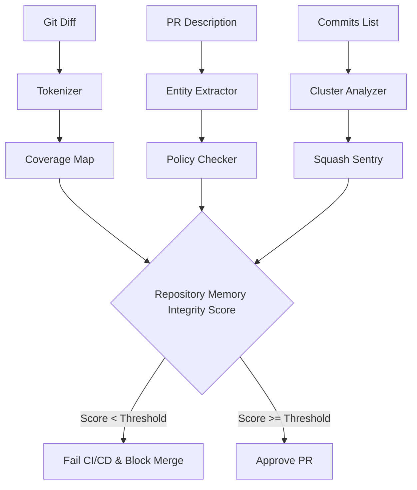

<div align="center">
  
  
  

  <h1>🕵️‍♂️ PRettySus</h1>
  <p><b>Deterministic PR Communication Quality & Repository Memory Analyzer</b></p>
  <p><i>Stop asking "Is this AI-generated?" Start asking "Does this preserve our repository's memory?"</i></p>
</div>

<br />

## 📖 The Problem: Squash-and-Merge Amnesia

When engineers use AI to write code, they often submit lazy, generic Pull Request descriptions (e.g., `"update things"`, `"fixed logic"`). Over time, this causes **Squash-and-Merge Amnesia**. The core engineering context—the *why* and the *how*—is lost forever. 

Existing tools try to solve this by using LLMs as "AI Detectors." This is fundamentally flawed: it is slow, expensive, sends private code to third parties, and constantly flags false positives.

## 💡 The Solution: Repository Memory Integrity

**PRettySus is a 100% deterministic, AI-free static analysis tool for engineering communication.**

Instead of guessing if text is AI-generated, PRettySus measures **Communication Coverage**. It parses the raw Git diff to extract the high-impact code entities modified (e.g., `jwt_manager`, `redis_cache`), and mathematically verifies that the PR description and commit messages actually mention them. 

If you write 400 lines of complex authentication code but your PR description is "fixes auth", PRettySus will fail your CI/CD pipeline.

---

## 🚀 Elite Key Features

- 🎯 **Communication Coverage Map**: Treats English text like code coverage. Extracts code entities from diffs and ensures high-impact files (security, DB, auth) are explicitly explained.
- 🛡️ **Main Branch Sentry**: A strict validation gate that prevents noisy, generic PRs from being squash-merged into the main branch history.
- 📊 **Squash Risk Analyzer**: Scans lists of commits to detect duplicate clusters, generic phrasing, and calculates a holistic "Squash Noise Score."
- 🔍 **Buried Signal Detection**: Identifies the single high-value commit hidden underneath 20 generic "fix logic" micro-commits.
- ⚙️ **Deterministic Summary Generator**: When a PR is too noisy, PRettySus synthesizes a copyable, context-rich summary entirely from diff analysis—without making a single LLM API call.
- 🚨 **Critical Policy Gates**: Automatically fails PRs that touch `migration` or `auth` files without including corresponding high-signal keywords in the description.

---

## 🧠 Core Architecture (100% AI-Free)

The system operates deterministically via tokenization, clustering, and strict coverage evaluation.



---

## 💻 3 Ways to Run PRettySus

### 1. Web Dashboard (Demo Mode)
Run the React + FastAPI web dashboard for a visual breakdown of your PRs.
```bash
make install
make demo # Starts backend on :8000 and frontend on :5173
```
*Note: Make sure you run `make backend` and `make frontend` in separate terminal windows.*

### 2. CLI Tool (Headless Mode)
Run PRettySus locally against files for fast, static analysis.
```bash
python -m app.cli analyze \
  --title "Update auth" \
  --description-file pr_body.md \
  --diff-file changes.patch \
  --commits-file commits.txt \
  --output report.json
```
*Returns exit code `1` if the PR fails safety policies.*

### 3. GitHub Action (CI/CD Gatekeeper)
Block bad communication before it merges. Add this to `.github/workflows/prettysus.yml`:
```yaml
name: PRettySus Gatekeeper
on: [pull_request]
jobs:
  analyze:
    runs-on: ubuntu-latest
    steps:
      - uses: actions/checkout@v4
      - name: Run PRettySus Communication Coverage
        uses: ./ 
        with:
          github_token: ${{ secrets.GITHUB_TOKEN }}
```

---

## 🛠️ Local Development & Setup

This repository is monorepo-style, containing both the analyzer backend and visualizer frontend.

| Command | Action |
|---|---|
| `make install` | Installs both Python and Node dependencies |
| `make backend` | Runs the FastAPI server (localhost:8000) |
| `make frontend`| Runs the Vite React server (localhost:5173) |
| `make test` | Runs the deterministic pytest suite |
| `make lint` | Runs ESLint and Python linting checks |

---

## ⚠️ Limitations & Strictness Design

Because PRettySus relies on strict deterministic word-boundary matching, it requires engineers to use the exact terms found in the codebase. 

**Example:** If a developer renames `user_auth` to `login_service` in their code, but writes *"Updated the login service"* in the PR description, PRettySus will flag it as **uncovered** unless the term `login_service` explicitly exists in the diff. 

*This is an intentional design choice to force strict, highly-searchable documentation that matches the actual code artifacts.*

---

## 🔮 Future Roadmap

- 🤖 **GitHub App Integration:** Native integration with GitHub App permissions for automated PR commenting and in-line suggestions.
- 📜 **Historical Repo Scanning:** Direct repository scanning to retroactively grade the quality of historical commits and identify amnesia hotspots.

---
<div align="center">
  <i>Built with React, Tailwind, FastAPI, and strict software engineering principles.</i>
</div>